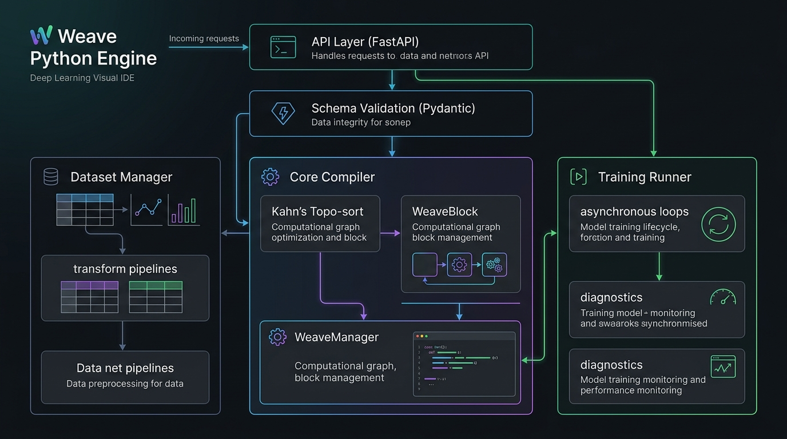
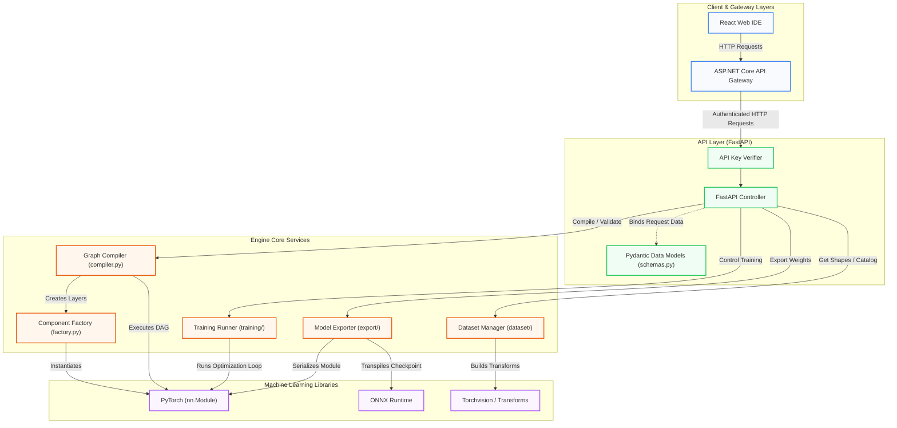
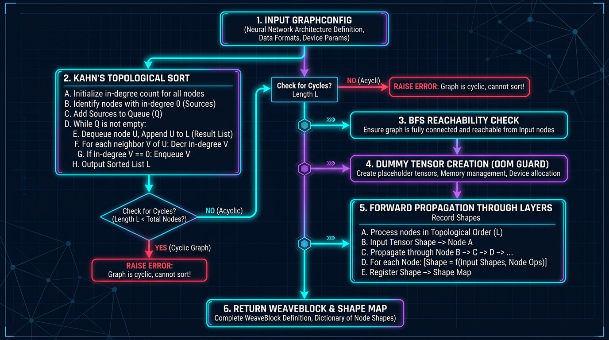
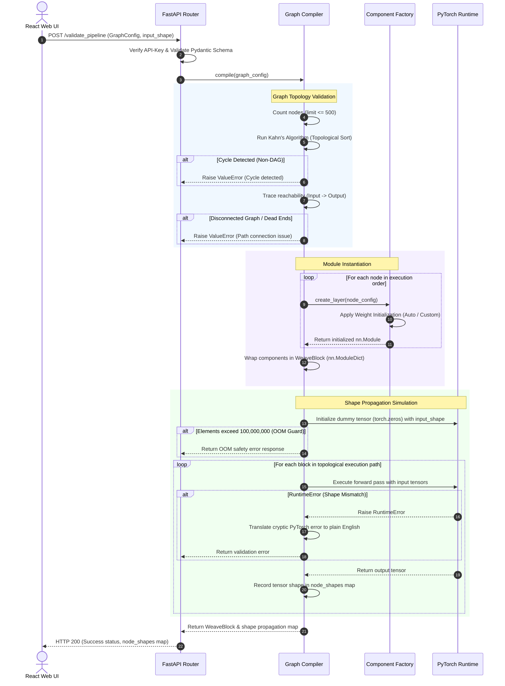
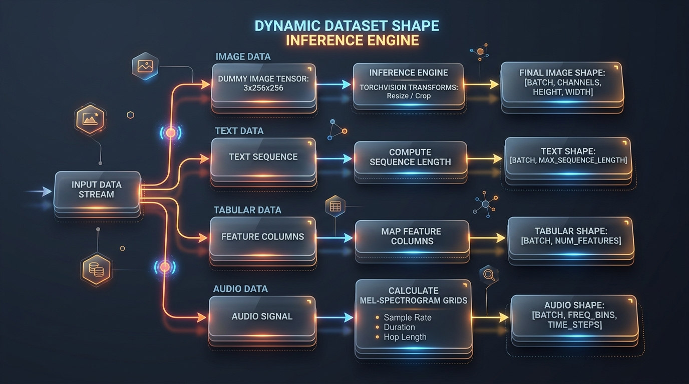
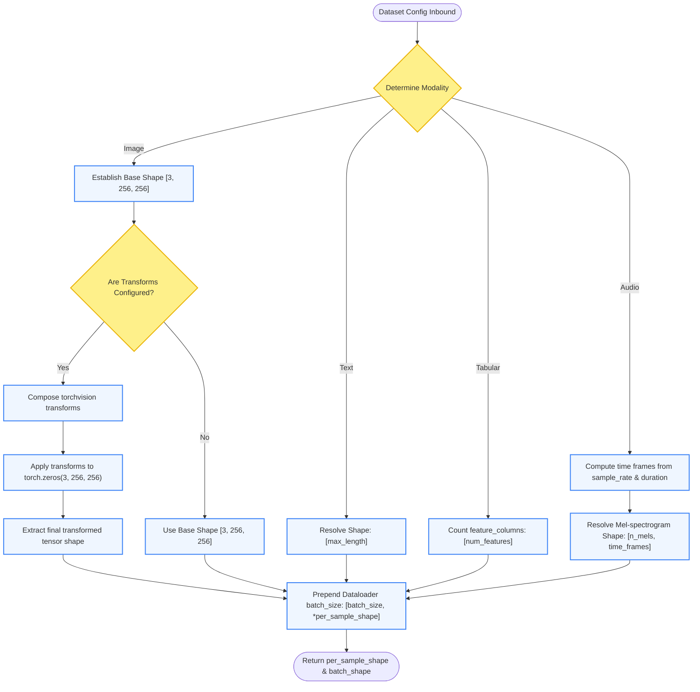
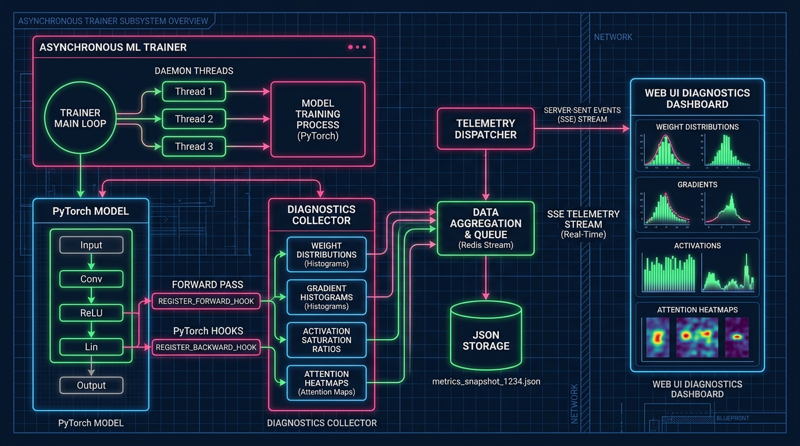
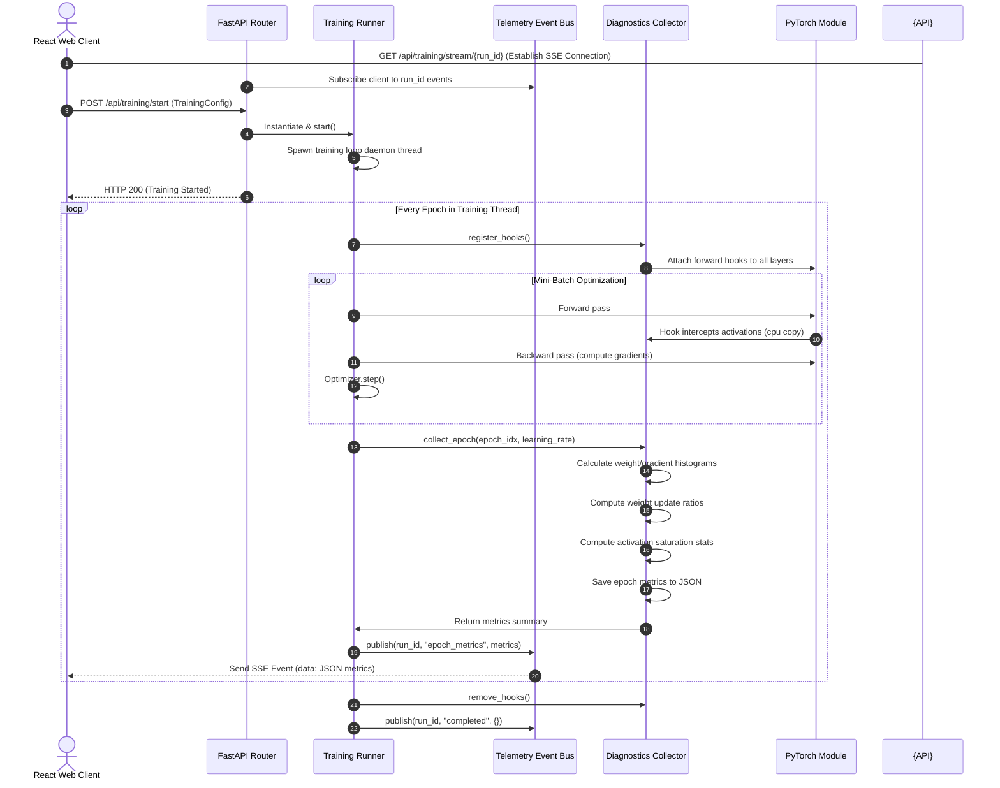

# Weave Python Engine: Comprehensive Architectural Design, Methodology, and Implementation

This document provides a highly detailed, academic-grade specification of the **Weave Python Engine**, a FastAPI-based microservice responsible for graph compilation, shape inference, dataset management, background model training, and codebase export within the Weave Visual IDE ecosystem. It contains comprehensive sequence flows, interactive Mermaid diagrams, math equations, and high-fidelity system design figures.

---

## Table of Contents
1. [Subsystem Overview & Architecture](#1-subsystem-overview--architecture)
2. [Graph Compilation & Validation (Chapter 3 & 4)](#2-graph-compilation--validation)
3. [Spatial Layer Transformations & Shape Propagation (Chapter 3)](#3-spatial-layer-transformations--shape-propagation)
4. [Dynamic Dataset Shape Inference & Preprocessing (Chapter 3)](#4-dynamic-dataset-shape-inference--preprocessing)
5. [Asynchronous Training Runner, SSE Telemetry & Diagnostics Collector (Chapter 3 & 4)](#5-asynchronous-training-runner-sse-telemetry--diagnostics-collector)
6. [Code Transpilation & Project Export Pipeline (Chapter 4)](#6-code-transpilation--project-export-pipeline)

---

## 1. Subsystem Overview & Architecture

The **Weave Python Execution Engine** is a specialized back-end service built on FastAPI. It decouples the heavy-duty computation (e.g., PyTorch dummy executions, neural network training, dataset metadata scanning) from the user-facing ASP.NET Core Gateway and React Web IDE, preventing application crashes, blockages, or high memory overhead on the client side.

The internal subsystems and their relation to adjacent layers are illustrated in **Figure 1.1**.


*Figure 1.1: Internal Subsystem Architecture of the Weave Python Execution Engine.*



The system is organized into the following primary layers:
1. **API Router & Middleware**: Implemented using FastAPI. It handles routing and validates API calls. It requires the `X-API-Key` header for secure verification.
2. **Pydantic Schema Validator**: Declared in [schemas.py](file:///D:/Project/Weave/engine/schemas.py), this layer parses inbound JSON payloads and translates them into strictly typed Python dataclasses representing node parameters, connection edges, and optimizer metrics.
3. **Graph Compiler & component Factory**: Dispatched in [compiler.py](file:///D:/Project/Weave/engine/compiler/compiler.py) and [factory.py](file:///D:/Project/Weave/engine/compiler/factory.py), this subsystem compiles visual graph layouts into functional PyTorch `nn.Module` objects, performing Kahn's topological sorting and BFS reachability checks.
4. **Dataset Manager & Transform Resolver**: Located in [dataset/](file:///D:/Project/Weave/engine/dataset/), this module queries metadata catalogs and evaluates target tensor dimensions dynamically without downloading raw binary payloads.
5. **Background Training Runner**: Located in [training/](file:///D:/Project/Weave/engine/training/), this engine runs standard training runs concurrently on separate daemon threads, using a push-based Event Bus to stream model statistics using Server-Sent Events (SSE).

---

## 2. Graph Compilation & Validation

The compilation pipeline converts visual nodes and edges into an executable PyTorch graph. The compilation and shape validation sequence is detailed in **Figure 2.1**.


*Figure 2.1: Graph Compilation and Shape Propagation Sequence.*



### 2.1 Topological Sorting (Kahn's Algorithm)

To establish an executable sequence, the compiler structures the network as a Directed Acyclic Graph (DAG) denoted by $G = (V, E)$, where $V$ represents the set of nodes and $E$ represents the set of directed connection edges. The in-degree $deg^-(v)$ for any node $v \in V$ is calculated as:

$$deg^-(v) = |\{ u \in V \mid (u, v) \in E \}|$$

The topological sort follows Kahn's algorithm:
1. Initialize a queue $S$ containing all start nodes with an in-degree of zero:
   
   $$S = \{ v \in V \mid deg^-(v) = 0 \}$$

2. While $S$ is not empty:
   * Remove a node $u$ from $S$ and append it to the sorted list $L$.
   * For each outgoing edge $(u, v) \in E$:
     * Remove the edge $(u, v)$ from the graph.
     * Decrement the in-degree of the neighbor: $deg^-(v) \leftarrow deg^-(v) - 1$.
     * If $deg^-(v) == 0$, insert $v$ into $S$.

3. If the final length of $L$ is less than the total number of nodes in the graph, a cycle exists, and a compilation error is raised:

   $$\text{If } |L| \neq |V| \implies \text{Graph is Cyclic (Non-DAG Error)}$$

### 2.2 Connection Reachability Analysis

Once the nodes are topologically sorted, a Breadth-First Search (BFS) is executed starting from the `"input"` node. Let $adj(u)$ denote the list of nodes directly connected to $u$.
- Let $R$ be the set of reachable nodes, initialized with $R = \{\text{"input"}\}$.
- A traversal queue $Q$ is initialized with $Q = [\text{"input"}]$.
- While $Q$ is not empty:
  * Dequeue $u$ from $Q$.
  * For each neighbor $v \in adj(u)$:
    * If $v \notin R$:
      * Add $v$ to $R$.
      * Enqueue $v$ in $Q$.

The compiler enforces the reachability constraint:

$$\text{"output"} \in R \quad \text{and} \quad |incoming\_edges(\text{"output"})| = 1$$

If this condition fails, or if there are isolated components, the compiler raises a connection validation exception.

### 2.3 Security Boundaries & OOM Guards

To protect against Denial-of-Service (DoS) and Out-Of-Memory (OOM) situations during dummy execution, the compiler enforces the following bounds:
- **Node Cap**: The graph compilation is strictly restricted to a maximum of 500 nodes.
- **Matrix Element Guard**: Let the dummy input dimensions be $(d_1, d_2, \dots, d_n)$. The total size of the dummy tensor is:

  $$N_{\text{elements}} = \prod_{i=1}^{n} d_i$$

  The compiler checks this against a safety threshold:
  
  $$\text{Verify } N_{\text{elements}} \le 100,000,000$$

  If this threshold is exceeded (equivalent to $\sim 400\text{MB}$ in float32), the allocation is blocked, returning a friendly warning to reduce batch sizes or image sizes.

---

## 3. Spatial Layer Transformations & Shape Propagation

The core engine tracks multidimensional tensor changes using standard shape conversion rules. The equations below detail how the engine calculates spatial dimension changes during validation.

### 3.1 2D Convolutional Layers ($Conv2d$)
Let the input height and width be $H_{in}$ and $W_{in}$. The output spatial dimensions $H_{out}$ and $W_{out}$ are computed as:

$$H_{out} = \left\lfloor \frac{H_{in} + 2 \times P - D \times (K - 1) - 1}{S} \right\rfloor + 1$$

$$W_{out} = \left\lfloor \frac{W_{in} + 2 \times P - D \times (K - 1) - 1}{S} \right\rfloor + 1$$

where $P$ is the padding, $D$ is the dilation, $K$ is the kernel size, and $S$ is the stride rate.

### 3.2 2D Pooling Layers ($MaxPool2d$ and $AvgPool2d$)
For spatial downsampling operations where dilation is typically 1:

$$H_{out} = \left\lfloor \frac{H_{in} + 2 \times P - K}{S} \right\rfloor + 1$$

$$W_{out} = \left\lfloor \frac{W_{in} + 2 \times P - K}{S} \right\rfloor + 1$$

### 3.3 Linear Projections ($Linear$)
For fully connected projections, high-dimensional tensors are flattened into 2D matrices. If input $X \in \mathbb{R}^{B \times F_{in}}$ is multiplied by weight matrix $W \in \mathbb{R}^{F_{out} \times F_{in}}$:

$$Y = XW^T + b$$

where the output tensor $Y \in \mathbb{R}^{B \times F_{out}}$. If the feature size of $X$ does not match $F_{in}$, the engine raises a shape mismatch exception.

### 3.4 Multi-Input & Branching Operations
- **Concat Layer**: Merges a list of input tensors $[X_1, X_2, \dots, X_k]$ along a target dimension $d$. It requires that all other dimensions match:
  
  $$\text{if } X_i \in \mathbb{R}^{B \times C_i \times H \times W} \implies X_{\text{out}} \in \mathbb{R}^{B \times \left(\sum_{i=1}^k C_i\right) \times H \times W} \quad (\text{for } d=1)$$

- **Add / Multiply Layer**: Performs element-wise operations on tensors. It requires that all input shapes match exactly:
  
  $$Y = X_1 + X_2 + \dots + X_k \implies \text{shape}(Y) = \text{shape}(X_i)$$

---

## 4. Dynamic Dataset Shape Inference & Preprocessing

The Dataset Subsystem resolves tensor shapes coming out of data loaders without downloading or loading raw dataset bytes. The dynamic shape inference pipeline is shown in **Figure 4.1**.


*Figure 4.1: Dynamic Dataset Shape Inference Flowchart.*



The shape inference calculations across modalities are computed as follows:

- **Image Modality**: Initialized with a standard base shape $[C, H, W] = [3, 256, 256]$. If transforms are active, they are composed into a `torchvision.transforms.Compose` pipeline and executed on a mock tensor:
  
  $$\text{per\_sample\_shape} = \text{shape}\left( \text{Transforms}\left( \text{torch.zeros}(3, 256, 256) \right) \right)$$

- **Text Modality**: Model inputs are token IDs mapped to integer arrays of shape $[L]$, where $L$ is the configured maximum sequence length (`max_length`).

- **Tabular Modality**: Evaluated as a 1D feature vector $[F]$, where the dimension $F$ is computed by counting the columns in the dataset schema:
  
  $$F = |\{\text{feature\_columns}\}|$$

- **Audio Modality**: Represented as a 2D Mel-spectrogram shape $[M, T]$, where $M$ is the number of mel bands (`n_mels`) and the temporal dimension $T$ is computed from sample rate ($SR$), maximum duration in seconds ($D$), and hop length ($H$):

  $$T = \left\lfloor \frac{SR \times D}{H} \right\rfloor + 1$$

---

## 5. Asynchronous Training Runner, SSE Telemetry & Diagnostics Collector

The **Training Runner** manages the lifecycle of training sessions asynchronously. It uses a thread pool to avoid blocking the main server threads. Telemetry data is pushed to the client in real-time, and internal model metrics are collected at the end of each epoch using custom PyTorch hooks.

The execution flow of the trainer and the telemetry pipeline is detailed in **Figure 5.1**.


*Figure 5.1: Asynchronous Training Runner and Telemetry Pipeline.*



### 5.1 Diagnostics Collector (PyTorch Hooks)

The `DiagnosticsCollector` collects weights, gradients, activations, update ratios, and attention heatmaps (for attention-based architectures) during training. It registers forward hooks on every sub-module of the model:

```python
def get_hook(module_name):
    def hook(mod, inp, out):
        if isinstance(out, torch.Tensor):
            self.activations[module_name] = out.detach().cpu()
    return hook
```

### 5.2 Diagnostics Mathematical Metrics

At the end of each epoch, the collector processes the saved state and calculates these metrics:

1. **Parameter Weight and Gradient Histograms**: Computes the mean, standard deviation, and a 10-bin histogram of the weight values $\theta^{(l)}$ and their gradients $\nabla_{\theta} \mathcal{L}^{(l)}$ for each layer $l$.

2. **Weight Update Ratio**: Monitors learning stability. It measures how much the weights changed during an update relative to their overall magnitude. For layer $l$ at epoch $t$ with learning rate $\eta$:

   $$\text{Update Ratio}^{(l)}_t = \frac{\sigma\left(\eta \cdot \nabla_{\theta} \mathcal{L}_t^{(l)}\right)}{\sigma\left(\theta_t^{(l)}\right) + \epsilon}$$

   where $\sigma(\cdot)$ is the standard deviation and $\epsilon = 10^{-8}$ is a safety constant to prevent division by zero. If this ratio is too small (e.g., $< 10^{-4}$), learning is slow; if it is too large (e.g., $> 10^{-1}$), training might be unstable.

3. **Activation Saturation Ratio**: Tracks how many activation values are in the saturating regions of activation functions (like Tanh or Sigmoid). For a layer activation tensor $A^{(l)}$:

   $$\text{Saturation}^{(l)} = \frac{1}{N_{\text{elements}}} \sum_{i=1}^{N_{\text{elements}}} \mathbb{I}\left(|A^{(l)}_i| > 0.97\right)$$

   where $\mathbb{I}(\cdot)$ is the indicator function. High saturation rates (e.g., $> 90\%$) indicate dead neurons or vanishing gradients.

4. **Attention Heatmap Extraction**: For self-attention layers, the collector extracts the raw attention weight matrix $A_{\text{attn}}$:

   $$A_{\text{attn}} = \text{softmax}\left(\frac{Q K^T}{\sqrt{d_k}}\right)$$

   It saves the first sample's attention matrix to visualize where the model is focusing.

---

## 6. Code Transpilation & Project Export Pipeline

The **Model Exporter** compiles the visual graph representation and generates a complete, standalone Python package. This allows users to download their models and run training or inference locally.

The exporter generates the following files:
1. `model.py`: Transpiles the visual nodes into standard PyTorch code. It generates a class that inherits from `nn.Module` and registers all layer components.
2. `dataset.py`: Generates the dataset class, data loading logic, and preprocessing transforms.
3. `train.py`: Generates the training loop, including optimizer setup, loss functions, learning rate scheduling, and logging.
4. `tokenizer.py`: If the model uses text input, this file implements a standalone Byte-Pair Encoding (BPE) or WordPiece tokenizer.
5. `requirements.txt`: Generates a list of required Python packages based on the configuration.
6. `README.md`: Explains how to install dependencies and run the training or inference scripts.

### 6.1 Abstract Syntax Tree (AST) Generation

The exporter converts the visual graph representation into code by walking the topologically sorted execution path.
- Let the sorted list of nodes be $L = [v_1, v_2, \dots, v_n]$.
- For each node $v_i$, the compiler queries its configuration parameters and generates the corresponding PyTorch layer definition.
- It tracks the variable names of intermediate tensors using a map:
  
  $$\text{VarMap}[v_i] = \text{"x\_" + } v_i.\text{id}$$

- For a node $v_i$ with incoming edges from $[u_1, u_2, \dots, u_m]$, the forward pass code is generated as:
  
  $$\text{code\_line} = \text{VarMap}[v_i] + \text{" = self."} + v_i.\text{id} + \text{"("} + \text{", ".join(VarMap}[u_j]\text{)} + \text{")"}$$

This generates a clean, readable, and executable PyTorch script that matches standard programming styles.
