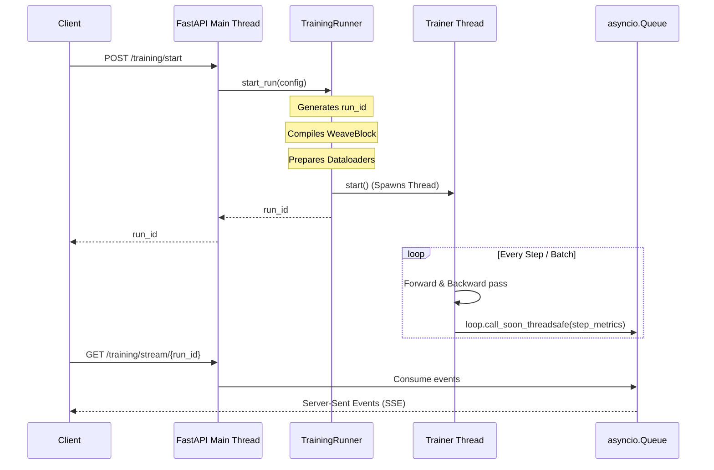

# Background Trainer & Runner

Weave uses a concurrent, multi-threaded background execution system to manage neural network training runs while keeping the main FastAPI ASGI application completely non-blocking.

## Execution Architecture

---

## The TrainingRunner

The `TrainingRunner` class is a singleton-like manager that handles:
- Generating unique `run_id` strings (UUIDs) for every run.
- Instantiating datasets, optimizers, loss functions, and learning rate schedulers.
- Spawning background `Trainer` threads.
- Maintaining mapping associations between `run_id` and active thread states / asyncio event queues.

### CUDA Device Fallback
If the user configuration requests `"cuda"` but `torch.cuda.is_available()` is false, the runner automatically fallback to `"cpu"` after logging a warning.

---

## The Trainer

The `Trainer` class encapsulates the background training loop that runs inside a spawned thread.

### Key Features

1. **GIL Yielding**: Since deep learning code can block the GIL and starve Python's event loop, the trainer forces a brief `time.sleep(0.001)` sleep inside batch loops to yield CPU cycles.
2. **Mixed Precision**: The trainer uses PyTorch's native `torch.amp.autocast` and `torch.amp.GradScaler` APIs to perform half-precision training on GPU.
3. **Gradient Accumulation**: Step updates are executed only once every $N$ batches based on the configured `gradient_accumulation_steps`.
4. **Queue Thread-Safety**: Since the main thread operates asynchronously, the trainer thread must not invoke `queue.put()` directly. It uses `loop.call_soon_threadsafe(queue.put_nowait, msg)` to push metric updates safely.
5. **Control Flags**: At step and epoch boundaries, the trainer checks flag registers (`is_paused`, `is_stopped`) and yields execution or stops accordingly.

---

## API Reference

::: training.runner.TrainingRunner
    options:
      show_root_heading: true

::: training.trainer.Trainer
    options:
      show_root_heading: true
