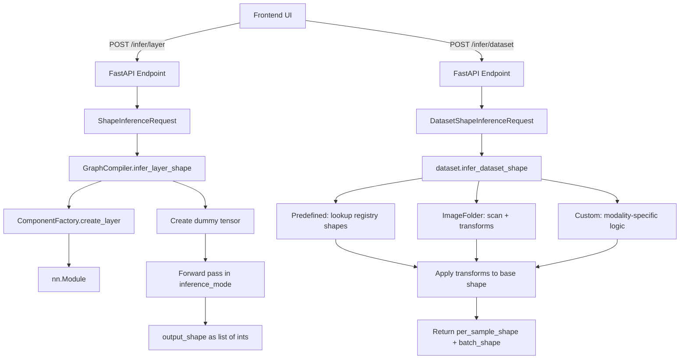

# Plan: Shape Inference Endpoints (`/infer/layer` and `/infer/dataset`)

## Context

The engine already has [`validate_pipeline`](engine/compiler/compiler.py:95) which runs dummy tensors through an entire graph to compute all node shapes. The task is to add **granular** shape inference endpoints that let the UI query shapes for **individual components** before the full graph is connected.

## Architecture



## Detailed Design

### 1. Schema Changes — [`schemas.py`](engine/schemas.py)

#### Extend `ShapeInferenceRequest` (line 717)

The existing schema only supports a single `input_shape`. Multi-input layers like `Add` and `Concat` need multiple input shapes. Replace with:

```python
class ShapeInferenceRequest(BaseModel):
    """POST /infer/layer — single layer shape check"""
    node: NodeConfig
    input_shape: list[int]                          # single-input layers
    input_shapes: list[list[int]] | None = None     # multi-input layers (Add, Concat)
```

**Rule**: If `node.type` is `Add`, `Concat`, or `Multiply`, the endpoint uses `input_shapes`. Otherwise it uses `input_shape`. If both are provided for a single-input layer, `input_shape` wins and `input_shapes` is ignored.

#### New `DatasetShapeInferenceRequest` / `DatasetShapeInferenceResponse`

```python
class DatasetShapeInferenceRequest(BaseModel):
    """POST /infer/dataset — dataset output shape check"""
    dataset_config: DatasetConfig

class DatasetShapeInferenceResponse(BaseModel):
    status: str  # "success" or "error"
    per_sample_shape: list[int] | None = None   # e.g. [3, 224, 224]
    batch_shape: list[int] | None = None         # e.g. [32, 3, 224, 224]
    num_classes: int | None = None               # classification datasets
    message: str | None = None
```

### 2. Dataset Shape Registry — [`datasets_registry.json`](engine/dataset/datasets_registry.json)

Add a `shape` field to each predefined dataset entry. This is the **per-sample tensor shape before transforms** (i.e., what `ToTensor()` produces):

```json
{
    "MNIST": {
        "module": "torchvision.datasets",
        "class": "MNIST",
        "default_params": {"train": true, "download": true},
        "shape": [1, 28, 28],
        "num_classes": 10
    },
    "CIFAR10": {
        "module": "torchvision.datasets",
        "class": "CIFAR10",
        "default_params": {"train": true, "download": true},
        "shape": [3, 32, 32],
        "num_classes": 10
    }
}
```

**Why static shapes?** Predefined datasets have fixed, well-known tensor shapes. Storing them avoids downloading the dataset just to infer shape. This is the simplest correct approach.

### 3. Layer Shape Inference — [`compiler.py`](engine/compiler/compiler.py)

Add `infer_layer_shape()` method to `GraphCompiler`:

```python
def infer_layer_shape(self, node: NodeConfig, input_shape: list[int] | None = None, input_shapes: list[list[int]] | None = None) -> dict:
```

**Logic flow:**

1. **Block nodes** (ResidualBlock, TransformerEncoder, etc.): These have a nested `graph: GraphConfig`. Call `self.validate_pipeline(node.graph, input_shape)` and extract the output shape from the result.

2. **Multi-input layers** (Add, Concat, Multiply): Use `input_shapes`. Create dummy tensors for each, instantiate the layer via `ComponentFactory`, run forward pass, return output shape.

3. **Single-input layers**: Use `input_shape`. Create a dummy tensor, instantiate the layer via `ComponentFactory`, run forward pass, return output shape.

4. **Governance**: Reuse the same `MAX_TENSOR_ELEMENTS` check from `validate_pipeline` to prevent OOM.

5. **Error handling**: Catch `RuntimeError` from PyTorch shape mismatches and return accessible error messages (same pattern as `validate_pipeline`).

**Key insight**: This method does NOT need topological sort or edge tracking — it's a single layer, so the logic is much simpler than `validate_pipeline`.

### 4. Dataset Shape Inference — new file [`engine/dataset/shape_inference.py`](engine/dataset/shape_inference.py)

```python
def infer_dataset_shape(config: DatasetConfig) -> dict:
```

**Logic by `source` type:**

| Source | Base Shape Logic | Transforms | num_classes |
|--------|-----------------|------------|-------------|
| `predefined` | Look up `shape` from registry JSON | Apply transform chain to base shape | From registry `num_classes` |
| `image_folder` | Default `[3, H, W]` — need scan or user-specified | Apply transform chain | From `scan_folder()` result |
| `custom/image` | Default `[3, H, W]` | Apply transform chain | From label source |
| `custom/text` | `[vocab_size]` or `[max_length]` depending on tokenizer | N/A | From data |
| `custom/tabular` | `[len(feature_columns)]` | N/A | From target cardinality |
| `custom/audio` | `[n_mels, time_frames]` | N/A | From label source |

**Transform shape inference**: Create a `build_transforms()` pipeline, pass a dummy tensor through it to get the post-transform shape. This is the most reliable approach since transforms like `Resize` and `RandomCrop` change spatial dimensions.

```python
def _apply_transforms_to_shape(base_shape: list[int], transforms: list[TransformConfig]) -> list[int]:
    if not transforms:
        return base_shape
    compose = build_transforms([t.model_dump() for t in transforms])
    dummy = torch.zeros(base_shape)
    # Add batch dim for torchvision transforms compatibility
    result = compose(dummy)
    return list(result.shape)
```

**Batch shape**: Prepend `batch_size` from `DataLoaderConfig` to `per_sample_shape`.

### 5. API Endpoints — [`main.py`](engine/main.py)

#### `POST /infer/layer`

```python
@app.post("/infer/layer", response_model=ShapeInferenceResponse)
def infer_layer_shape(request: ShapeInferenceRequest):
    try:
        result = compiler.infer_layer_shape(
            node=request.node,
            input_shape=request.input_shape,
            input_shapes=request.input_shapes,
        )
        return ShapeInferenceResponse(**result)
    except Exception as e:
        return ShapeInferenceResponse(
            status="error",
            message=f"Shape inference failed: {str(e)}",
        )
```

#### `POST /infer/dataset`

```python
@app.post("/infer/dataset", response_model=DatasetShapeInferenceResponse)
def infer_dataset_shape(request: DatasetShapeInferenceRequest):
    try:
        result = infer_dataset_shape(request.dataset_config)
        return DatasetShapeInferenceResponse(**result)
    except Exception as e:
        return DatasetShapeInferenceResponse(
            status="error",
            message=f"Dataset shape inference failed: {str(e)}",
        )
```

### 6. Test Plan

#### Unit tests — [`engine/tests/test_shape_inference.py`](engine/tests/test_shape_inference.py) (new file)

| Test | Description |
|------|-------------|
| `test_infer_conv2d_shape` | Conv2d with known input → correct output spatial dims |
| `test_infer_linear_shape` | Linear with matching in_features → correct output |
| `test_infer_relu_shape` | Activation preserves shape |
| `test_infer_flatten_shape` | Flatten produces correct product dims |
| `test_infer_maxpool2d_shape` | Pooling reduces spatial dims correctly |
| `test_infer_concat_shape` | Concat with `input_shapes` → concatenated dim |
| `test_infer_add_shape` | Add with matching `input_shapes` → same shape |
| `test_infer_layer_shape_mismatch` | Linear with wrong in_features → error status |
| `test_infer_layer_oom_guard` | Huge input_shape → governance error |
| `test_infer_block_node_shape` | ResidualBlock with nested graph → output shape |

#### Unit tests — [`engine/tests/test_dataset_shape.py`](engine/tests/test_dataset_shape.py) (new file)

| Test | Description |
|------|-------------|
| `test_predefined_mnist_shape` | MNIST → `[1, 28, 28]` per-sample |
| `test_predefined_cifar10_shape` | CIFAR10 → `[3, 32, 32]` per-sample |
| `test_predefined_with_resize_transform` | MNIST + Resize(224) → `[1, 224, 224]` |
| `test_predefined_batch_shape` | batch_size=64 → `[64, 1, 28, 28]` |
| `test_image_folder_shape` | ImageFolder with default shape |
| `test_custom_tabular_shape` | Custom tabular → `[len(features)]` |
| `test_custom_audio_shape` | Custom audio → `[n_mels, time_frames]` |
| `test_unknown_predefined_dataset` | Unsupported name → error |

#### API integration tests — add to existing test structure

| Test | Description |
|------|-------------|
| `test_infer_layer_endpoint_conv2d` | POST /infer/layer with Conv2d node |
| `test_infer_layer_endpoint_concat` | POST /infer/layer with Concat + input_shapes |
| `test_infer_dataset_endpoint_mnist` | POST /infer/dataset with predefined MNIST config |

## File Change Summary

| File | Action | Description |
|------|--------|-------------|
| [`engine/schemas.py`](engine/schemas.py) | Modify | Add `input_shapes` to `ShapeInferenceRequest`; add `DatasetShapeInferenceRequest` and `DatasetShapeInferenceResponse` |
| [`engine/dataset/datasets_registry.json`](engine/dataset/datasets_registry.json) | Modify | Add `shape` and `num_classes` fields to MNIST and CIFAR10 entries |
| [`engine/compiler/compiler.py`](engine/compiler/compiler.py) | Modify | Add `infer_layer_shape()` method |
| [`engine/dataset/shape_inference.py`](engine/dataset/shape_inference.py) | Create | New module with `infer_dataset_shape()` function |
| [`engine/main.py`](engine/main.py) | Modify | Add `/infer/layer` and `/infer/dataset` endpoints |
| [`engine/tests/test_shape_inference.py`](engine/tests/test_shape_inference.py) | Create | Layer shape inference unit tests |
| [`engine/tests/test_dataset_shape.py`](engine/tests/test_dataset_shape.py) | Create | Dataset shape inference unit tests |

## Execution Order

1. Schemas first (other code depends on them)
2. Registry JSON update (dataset shapes)
3. `GraphCompiler.infer_layer_shape()` (core logic)
4. `dataset/shape_inference.py` (core logic)
5. API endpoints in `main.py` (wires logic to HTTP)
6. Tests (validate everything)
